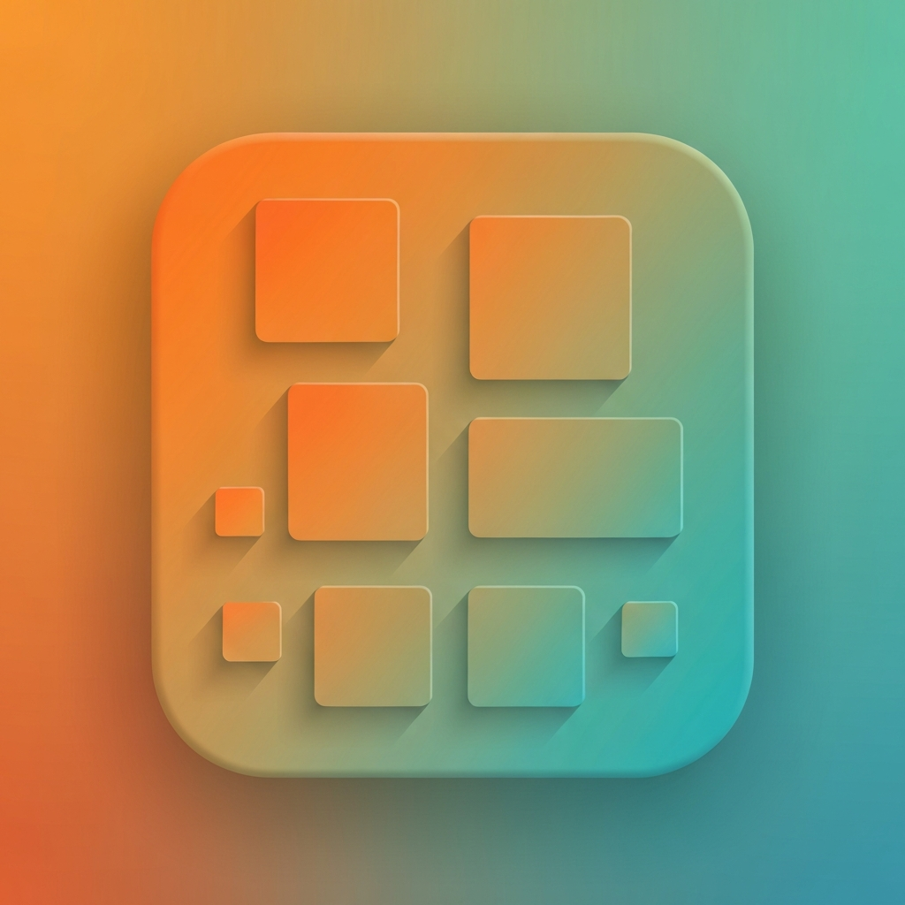

<p align="center">
  
</p>

<h1 align="center">Image Asset Manager</h1>

<p align="center">A native macOS and iPad app for AI image generation, asset management, and consulting workflow integration.</p>

---

> **Status:** v1.0 submitted to the Mac App Store and iPad App Store — review pending.

## What it is

Image Asset Manager brings the discipline of a proper asset library to AI image generation. Every prompt, variant, project, and pound spent is tracked, organised, and retrievable later. Built for designers, brand consultants, and creative directors who use AI imagery in client work.

It is a single universal SwiftUI app with a three-panel layout on macOS and a two-column NavigationSplitView on iPad. iPhone is intentionally out of scope.

## Features

- **AI image generation** across Google's Imagen 4 (Fast, Standard, Ultra) and Gemini 2.5 Flash Image, auto-routed based on whether the prompt has reference images
- **Per-generation budget guardrails** in GBP — overspend protection enforced before the API call is made
- **Reference images** by role (style anchor / subject anchor), capped at three per prompt
- **Variant families** group iterations of the same concept so nothing ends up as an orphan generation
- **Multi-project memberships** — assets can live in multiple projects with a designated primary
- **Clients, tags, and a structured prompt library** as first-class objects
- **Spend dashboard** with Swift Charts visualisation by day, model, and project
- **iCloud Drive** sync by default, or a custom library folder of your choice
- **Local MCP server** exposes the asset library to Anthropic's Claude Code CLI on `127.0.0.1:47821`

## Technology

- Swift 6 with strict concurrency throughout
- SwiftUI on macOS 26 and iPadOS 26
- SQLite via [GRDB](https://github.com/groue/GRDB.swift) 7.x — the sole external dependency
- Swift Charts for the spend dashboard
- macOS Keychain for API key storage
- A local Swift `NWListener` HTTP server for the MCP integration
- A Node.js MCP proxy in `mcp-server/` for the Claude Code-facing side

API keys are stored only in the Keychain — never in iCloud, the library directory, or the source tree.

## Building locally

You will need Xcode 26.x and an Apple developer account configured for code signing.

```bash
git clone https://github.com/Jay-Hell/image-asset-manager.git
cd image-asset-manager
open ImageAssetManager/ImageAssetManager.xcodeproj
```

Command-line builds:

```bash
# macOS
xcodebuild -project ImageAssetManager/ImageAssetManager.xcodeproj \
  -scheme ImageAssetManager -destination 'platform=macOS' build

# iPad Pro simulator
xcodebuild -project ImageAssetManager/ImageAssetManager.xcodeproj \
  -scheme ImageAssetManager \
  -destination 'platform=iOS Simulator,name=iPad Pro 13-inch (M4)' build

# Run the Core package tests
swift test --package-path ImageAssetManager/ImageAssetManager/ImageAssetManagerCore
```

To use the app you will need:

- A Google AI Studio API key — free to create at https://aistudio.google.com/apikey
- Optionally, an Anthropic API key for prompt refinement — https://console.anthropic.com/settings/keys

Both are entered in the in-app **Settings** and stored in Keychain.

## Repository layout

The repo follows a standard Xcode structure with one embedded Swift package for business logic:

- `ImageAssetManager/ImageAssetManager/` — the universal app target (SwiftUI views only)
- `ImageAssetManager/ImageAssetManager/ImageAssetManagerCore/` — embedded Swift package containing all business logic, data access, and provider abstraction (no SwiftUI imports)
- `mcp-server/` — the Node.js MCP proxy for Claude Code integration

For a detailed architectural overview — including the database schema migrations, provider abstraction, generation pipeline, and platform strategy — see [CLAUDE.md](CLAUDE.md).

## Support

- [Privacy policy](https://ionicconsulting.co.uk/image-asset-manager/privacypolicy)
- [Support and FAQ](https://ionicconsulting.co.uk/image-asset-manager/support)
- Email: john@ionicconsulting.co.uk

## Licence

Source code is published here for reference and transparency. All rights reserved by Ionic Consulting Ltd. For reuse, redistribution, or contribution enquiries, please email john@ionicconsulting.co.uk.

---

Built by [Ionic Consulting](https://ionicconsulting.co.uk).
